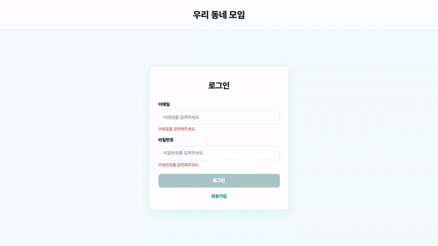
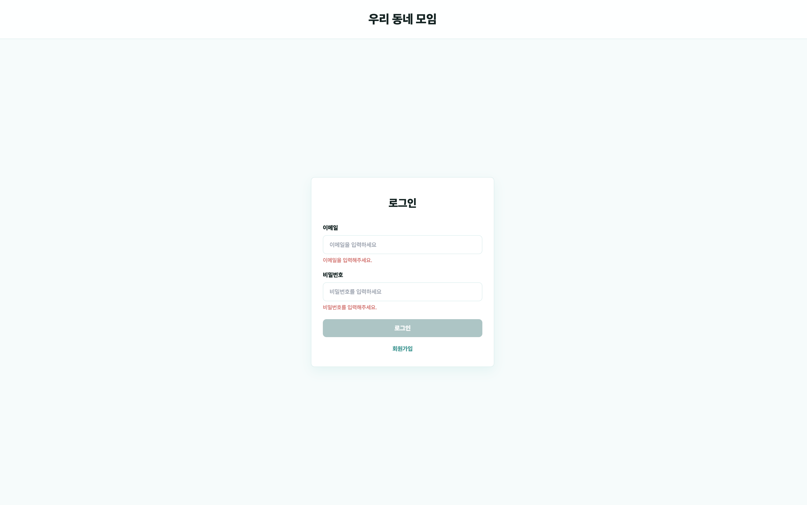
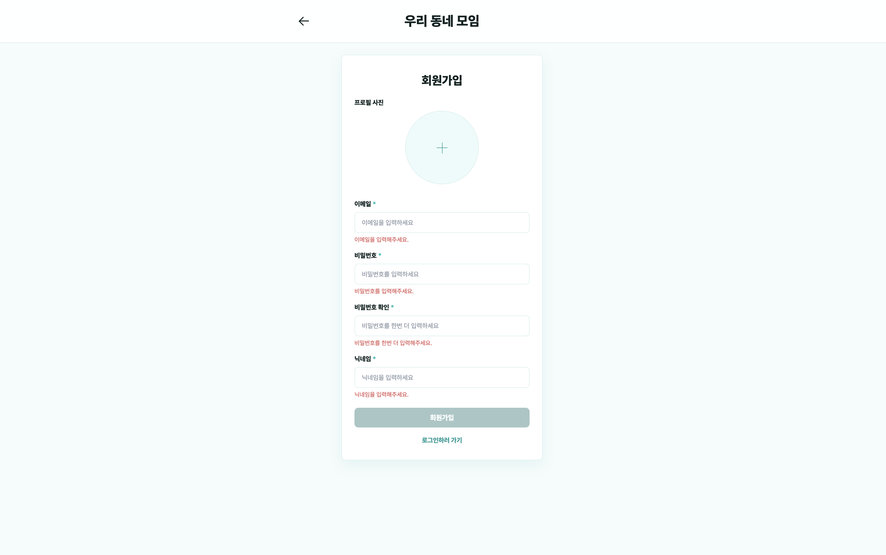
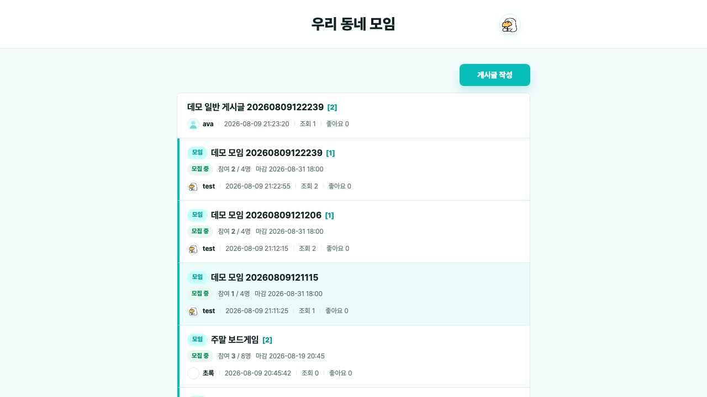
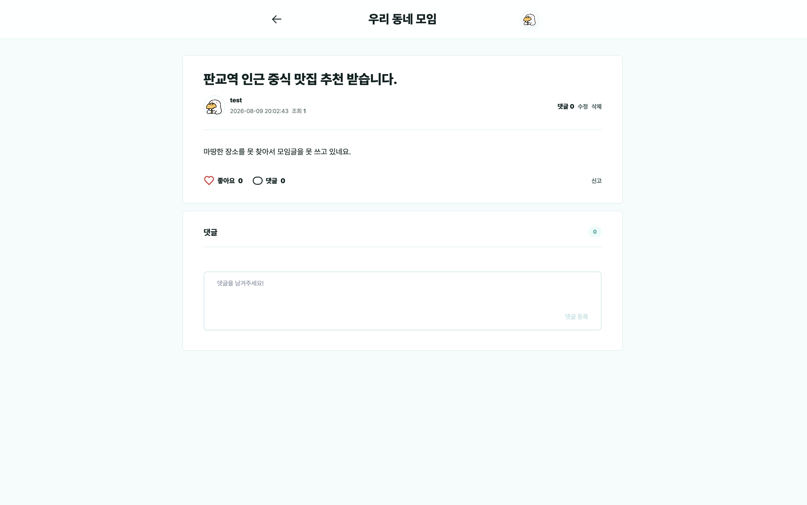
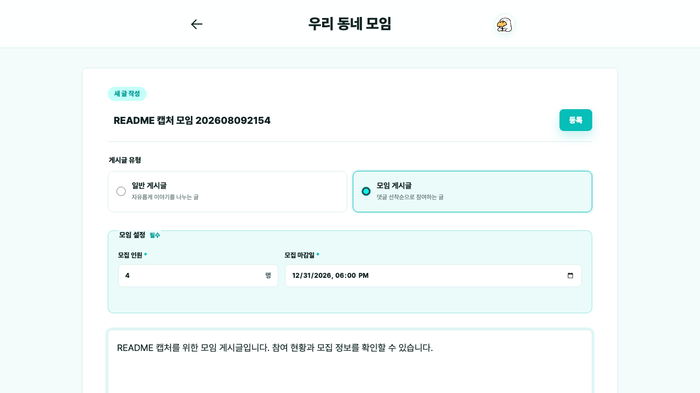
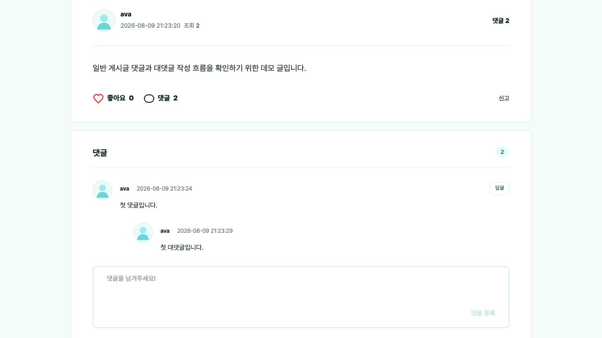
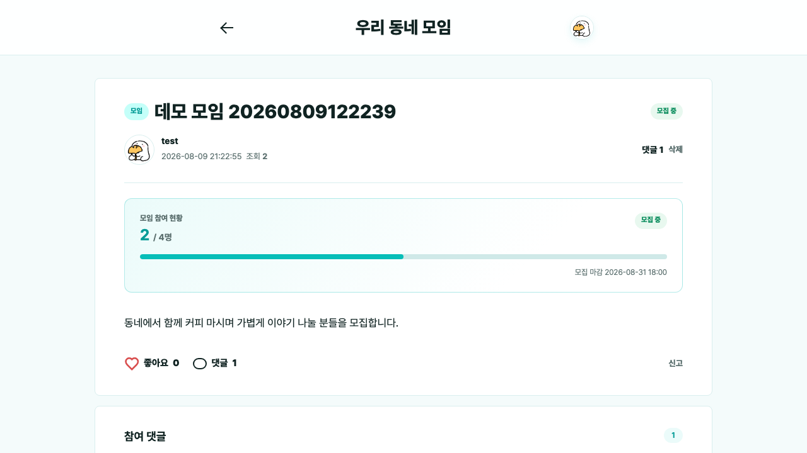
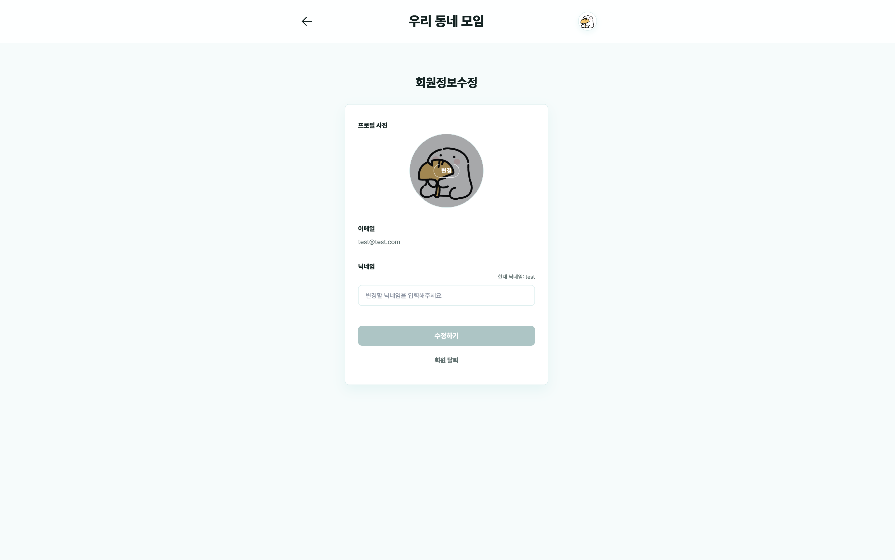
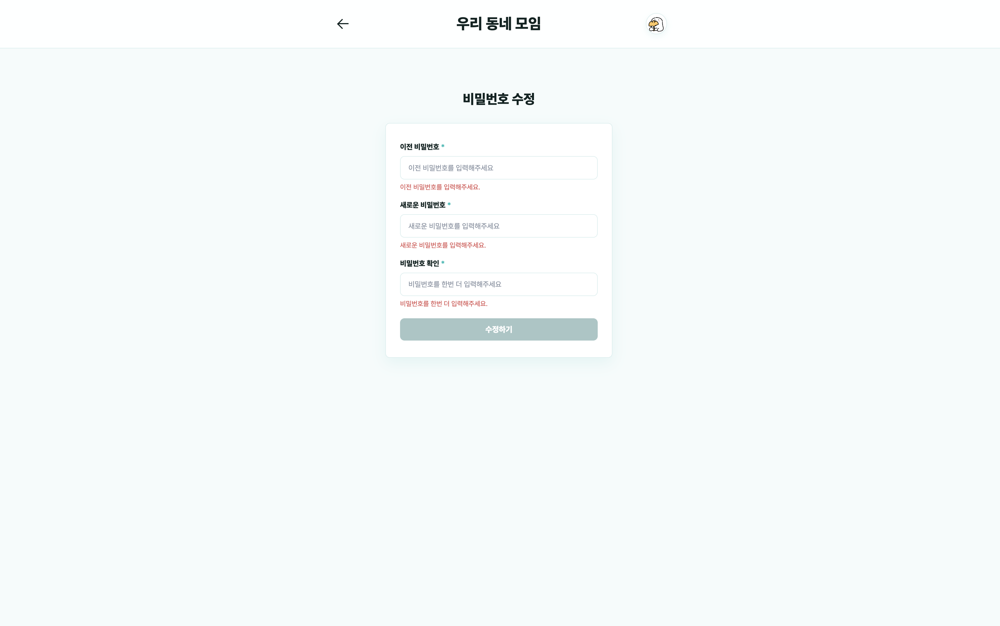

# 🏘️우리동네모임

## Front-end 소개

- 동네 이웃과 소통하고, 관심사 기반 모임을 열고 참여할 수 있는 `커뮤니티 게시판` 프로젝트입니다.
- `React`와 `Vite`를 사용하여 구현한 SPA입니다.
- 기존 Vanilla JS 화면 흐름을 React 컴포넌트, route 단위 page, feature 단위 API/hook 구조로 `직접 마이그레이션`했습니다.
- 회원가입, 로그인, 게시글 CRUD, 댓글/답글, 좋아요, 신고, 임시저장, 프로필 수정까지 백엔드 API와 연결했습니다.

### 개발 인원 및 기간

- 개발기간 : 2026-07-13 ~ 진행 중
- 개발 인원 : 프론트엔드 1명 (본인)

### 사용 기술 및 tools

- React, React Router
- Vite
- JavaScript, CSS
- Fetch API
- ESLint / Prettier
- Docker / Nginx

### Back-end

- <a href="https://github.com/100-hours-a-week/KTB4-Ava-Week6">Back-end Github</a>

### 폴더 구조

- `src/app` : 전역 provider, route, layout, error page를 관리합니다.
- `src/pages` : route 단위 화면 컴포넌트를 배치합니다.
- `src/features` : auth, posts, post-editor, post-detail, comments, profile처럼 domain별 API와 hook을 배치합니다.
- `src/shared` : 공통 API client, 인증 저장소, feedback UI, validation, format, 공통 UI를 관리합니다.
- `src/constants` : route path, API path, 사용자 메시지, asset 경로 등 전역 상수를 관리합니다.
- `nginx` : Docker 배포와 직접 배포에서 사용하는 Nginx 설정을 관리합니다.

<br/>

## 서비스 화면

`데모 영상`



[원본 영상 보기](docs/assets/demo.mov)

`인증`

| 로그인 | 회원가입 |
| --- | --- |
|  |  |

`게시글`

| 목록 | 상세 | 작성/수정 |
| --- | --- | --- |
|  |  |  |

`댓글과 모임 참여`

| 댓글 | 모임 게시글 |
| --- | --- |
|  |  |

`마이페이지`

| 프로필 수정 | 비밀번호 변경 |
| --- | --- |
|  |  |

<br/>

## 주요 기능

### 인증

- 회원가입, 로그인, 로그아웃 기능을 구현했습니다.
- access token을 저장하여 로그인 상태를 유지합니다.
- refresh token cookie를 사용하여 access token 만료 시 세션을 복구합니다.
- 세션 복구에 실패하면 인증 정보를 초기화하고 로그인 화면으로 이동합니다.

### 라우팅

- React Router 기반 route를 구성했습니다.
- 로그인 사용자는 `/login`, `/register` 접근 시 `/posts`로 이동합니다.
- 비로그인 사용자는 보호 route 접근 시 `/login`으로 이동합니다.
- 페이지 컴포넌트는 lazy loading으로 불러오고 공통 loading fallback을 사용합니다.

### 게시글

- 게시글 목록 조회와 cursor 기반 추가 로드를 구현했습니다.
- 게시글 작성, 상세 조회, 수정, 삭제를 구현했습니다.
- 게시글 이미지 업로드를 `FormData` 기반으로 처리합니다. 업로드 이미지는 확장자와 용량(3MB 이하)을 함께 검사합니다.
- 게시글 좋아요 토글과 신고 기능을 구현했습니다.
- 게시글 유형을 `일반 게시글`과 `모임 게시글`로 구분해서 작성할 수 있습니다.

### 모임

- 모임 게시글은 작성 시 작성자를 포함한 모집 인원(2명 이상)과 모집 마감일을 필수로 입력합니다.
- 모집 상태를 `모집 중` / `정원 마감` / `기간 마감`으로 구분해 목록과 상세 화면에 표시합니다.
- 참여는 댓글 작성으로 이루어지며, 게시글 작성 시 작성자를 포함해 참여 인원 1명으로 시작합니다.
- 참여 인원과 모집 상태는 서버가 계산한 값을 기준으로 갱신합니다.
- 상세 화면에서는 참여 현황을 숫자와 progress bar로 함께 보여줍니다.
- 모임 게시글의 댓글은 참여 신청 성격을 가지므로, 일반 게시글과 달리 답글/수정/삭제를 제공하지 않습니다.

### 임시저장

- 새 게시글 작성 화면 진입 시 임시저장 글을 조회하거나 생성합니다.
- 입력 변경 후 2초 동안 추가 입력이 없으면 자동저장을 실행합니다.
- 작성 중 최대 30초 간격으로 저장을 재시도합니다.
- 자동저장 실패 시 toast와 재시도 action을 제공합니다.

### 댓글

- 댓글과 답글 목록을 tree 형태로 렌더링합니다.
- 일반 게시글에서는 댓글과 답글 작성, 수정, 삭제를 구현했습니다.
- 댓글 작성/삭제 후 게시글의 댓글 수를 화면에서 즉시 갱신합니다.
- 댓글 작성자의 프로필 이미지를 함께 표시합니다.

### 프로필

- 내 정보 조회와 프로필 수정을 구현했습니다.
- 프로필 이미지 업로드를 지원합니다.
- 비밀번호 변경을 구현했습니다.
- 탈퇴 사유를 입력한 뒤 회원 탈퇴할 수 있습니다.

<br/>

## API 연동

모든 API 요청은 `src/shared/api/client.js`의 공통 client를 통해 처리합니다.

```json
{
  "success": true,
  "message": "post_retrieved_success",
  "data": {}
}
```

- API base URL은 `VITE_API_BASE_URL` 환경변수로 관리합니다.
- 기본 API base URL은 `/api`입니다.
- 모든 요청은 `credentials: include` 옵션을 포함합니다.
- 인증 요청은 `Authorization: Bearer {accessToken}` header를 포함합니다.
- 401 응답 발생 시 `/auth/refresh`를 한 번 호출하고 원 요청을 재시도합니다.
- 여러 요청이 동시에 401을 받아도 refresh 요청은 하나만 실행되도록 처리했습니다.
- 서버 error code는 `src/constants/messages.js`에서 사용자 문구로 매핑합니다.

<br/>

## 실행 방법

### 설치

```bash
npm install
```

### 개발 서버 실행

```bash
npm run dev
```

개발 서버는 기본적으로 `http://localhost:5173`에서 실행됩니다.

### 환경변수

`.env.development`

```env
VITE_API_BASE_URL=http://localhost:8080
```

`.env.production`

```env
VITE_API_BASE_URL=/api
```

백엔드 주소를 직접 지정해서 실행할 수도 있습니다.

```bash
VITE_API_BASE_URL=http://localhost:8080 npm run dev
```

### 빌드

```bash
npm run build
```

### 빌드 결과 확인

```bash
npm run preview
```

### 검증

```bash
npm run lint
npm run format:check
npm run build
```

<br/>

## 배포

### Docker

```bash
docker build -t our-neighborhood-community-react .
docker run --rm -p 80:80 our-neighborhood-community-react
```

Docker 실행 시 Nginx는 `/api/`, `/public/images/` 요청을 백엔드 서버로 proxy합니다.

```bash
docker run --rm -p 80:80 \
  -e BACKEND_HOST=host.docker.internal \
  -e BACKEND_PORT=8080 \
  our-neighborhood-community-react
```

### Nginx

- `nginx/nginx.docker.conf` : Docker 이미지에서 사용하는 Nginx template입니다.
- `nginx/nginx.direct.conf` : 서버에 직접 배포할 때 사용하는 Nginx 설정입니다.
- SPA fallback은 `try_files $uri $uri/ /index.html`로 처리합니다.
- 두 설정 모두 `Host $http_host`와 `X-Forwarded-Host` header를 백엔드로 전달해, 배포 포트가 80이 아니어도 응답 URL에 포트가 유지되도록 합니다.
- 이미지 업로드 용량은 `client_max_body_size 3m`으로 제한하며, 프론트 `validateImage`도 동일한 3MB 기준으로 검사합니다.

<br/>

## 개발 컨벤션

- route path는 `src/constants/routes.js`에서 관리합니다.
- API path는 `src/constants/api.js`에서 관리합니다.
- 사용자 메시지와 API error code 매핑은 `src/constants/messages.js`에서 관리합니다.
- domain별 API와 hook은 `src/features` 하위에 배치합니다.
- route 단위 화면은 `src/pages` 하위에 배치합니다.
- 공통 API client, validation, UI, feedback은 `src/shared` 하위에 배치합니다.

### Git Hook

```bash
npm run prepare
```

pre-commit 시 `lint-staged`가 실행됩니다.

- `src/**/*.{js,jsx}` : ESLint 자동 수정, Prettier 적용
- `*.config.js` : ESLint 자동 수정, Prettier 적용
- `src/**/*.{css,json,md}` : Prettier 적용
- `{package.json,README.md}` : Prettier 적용

<br/>

## 트러블 슈팅

### 1. access token 만료 시 refresh 요청 중복 발생

- **문제** : 여러 API가 동시에 401을 받으면 `/auth/refresh` 요청이 중복 발생했습니다.
- **원인** : 각 요청이 401을 독립적으로 처리해 refresh 요청을 공유하지 않았습니다.
- **해결** : `src/shared/api/client.js`에서 `refreshPromise`를 공유해 refresh는 한 번만 실행하고, 성공 시 원 요청을 한 번만 재시도하도록 했습니다. 실패 시 인증 정보를 초기화하고 로그인 화면으로 이동하게 처리했습니다.

### 2. 임시저장 autosave와 최종 등록 요청이 충돌하는 문제

- **문제** : autosave 진행 중 등록을 누르면 임시저장 ID가 확정되지 않았거나 이전 입력값 기준으로 저장될 수 있었습니다.
- **원인** : autosave와 submit이 같은 데이터를 다루지만 서로의 진행 상태를 기다리지 않았습니다.
- **해결** : `usePostEditor`에서 `temporaryIdRef`, `inFlightSaveRef`, `editVersionRef`, `saveQueuedRef`를 사용해 저장 중인 요청과 최신 입력 상태를 분리했습니다. 최종 등록 시 진행 중인 autosave를 기다린 뒤 `temporaryPostId`를 포함해 게시글 생성 API를 호출했습니다.

<br/>

## 프로젝트 회고

자세한 회고는 [docs/retrospective.md](docs/retrospective.md)에서 확인할 수 있습니다.

- Vanilla JS에서 React로 전환하며 단순 문법 변환보다 기존 동작과 책임을 먼저 이해하는 과정이 중요하다는 것을 배웠습니다.
- 인증 복구, 자동저장, 댓글 정책처럼 여러 화면에 영향을 주는 로직은 공통 계층과 명확한 상태 관리가 필요했습니다.
- AI를 활용할 때도 구현 요청보다 프로젝트 맥락, 변경 범위, 검증 기준을 문서화하는 것이 결과 품질에 더 큰 영향을 준다는 것을 경험했습니다.

<br/>
<br/>
<br/>
